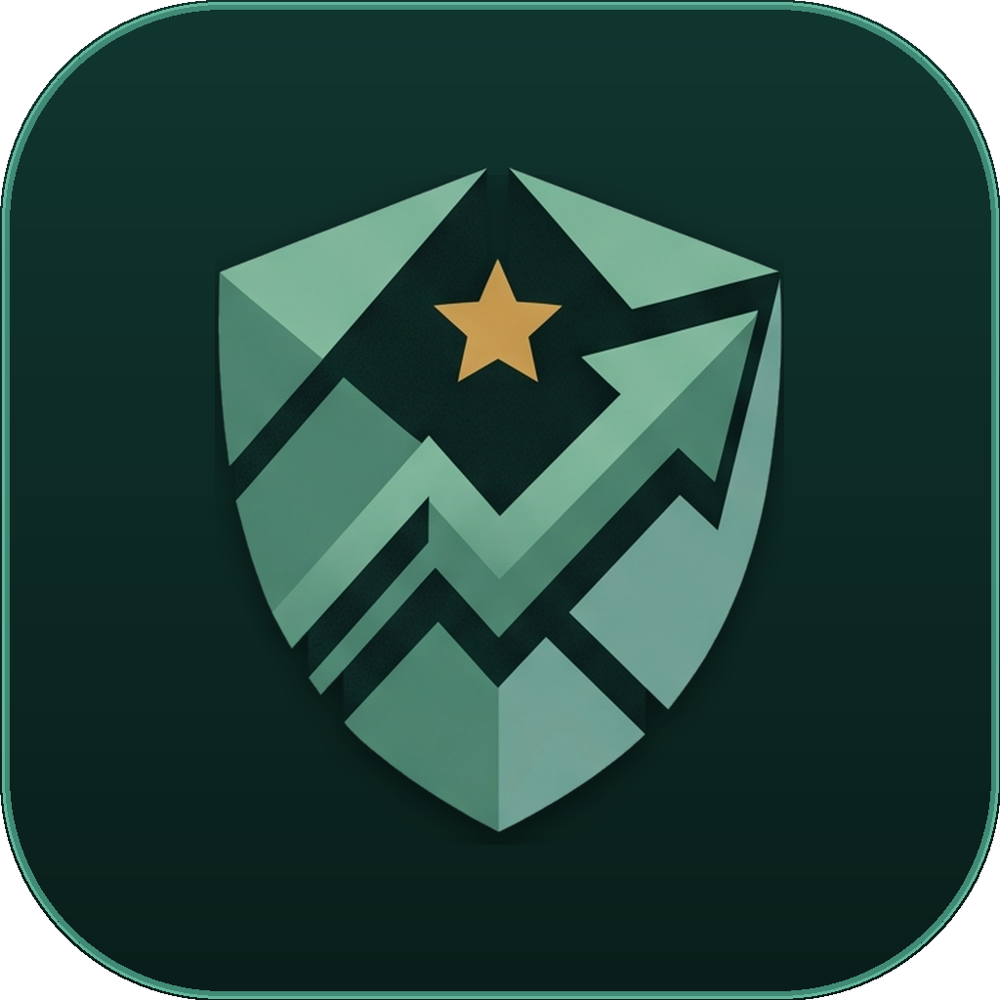

# 🎮 LevelUp Money Life

<p align="center">
  
</p>

<p align="center">
  <b>Modern Gamified Personal Finance & Life Tracker Desktop App</b><br/>
  <i>Finance First, Game Layer Second • 100% Local-First, Private & High-Performance</i>
</p>

<p align="center">
  
  
  
  
  
  
  
  
  
</p>

---

<p align="center">
  <a href="#-english"><b>English</b></a> •
  <a href="#-ภาษาไทย"><b>ภาษาไทย</b></a> •
  <a href="#-keyboard-shortcuts"><b>Shortcuts</b></a> •
  <a href="#-tech-stack"><b>Tech Stack</b></a> •
  <a href="#-project-structure"><b>Project Structure</b></a> •
  <a href="#-getting-started"><b>Getting Started</b></a>
</p>

---

## 🇬🇧 English

### 🌟 Overview

**LevelUp Money Life** is an ultra-fast, privacy-first desktop application designed to make personal financial management effortless, clear, and engaging. By seamlessly fusing **Notion-style high-density data tables** with an **RPG gamification layer (XP, Streaks, Daily Quests & Level Progression)**, **1-Click Smart Logging**, and **tactile dynamic micro-interactions**, it transforms daily expense tracking into an enjoyable discipline.

> **Design Philosophy:** *Finance first, game layer second.* Your money data is always clean, clear, and accurate. The game mechanics and fluid micro-interactions motivate consistent habits without visual clutter or getting in the way of serious financial decisions.

---

### ✨ Core Features

```
┌────────────────────────────────────────────────────────────────────────┐
│                        LEVELUP MONEY LIFE ARCHITECTURE                 │
├──────────────────┬───────────────────┬─────────────────────────────────┤
│  ⚡ QUICK INPUT  │  📊 ANALYTICS     │  🎮 GAMIFICATION & MOTION       │
│  • 1-Tap Presets │  • Safe-to-Spend  │  • RPG Leveling (Lv 1 - 50)     │
│  • Smart Parser  │  • 50/30/20 Budget│  • Daily Habit Quests           │
│  • Autocomplete  │  • Thai Tax Engine│  • Spotlight Hover Glows        │
│  • Slip OCR Scan │  • Donut Charts   │  • Spring Numeric Tickers       │
│  • Undo Toast    │  • Cash Flow Trend│  • Tactile Micro-Spring Buttons │
└──────────────────┴───────────────────┴─────────────────────────────────┘
```

#### 1. ⚡ Quick Command Bar & One-Tap Presets
- **One-Tap Quick Logging**: Click preconfigured buttons (☕ Coffee 60฿, 🍱 Lunch 70฿, 🚇 Transit 45฿, 🛒 7-11 100฿, ⛽ Fuel 500฿) to log expenses in under 1 second.
- **Smart Frequent Suggestion**: Automatically analyzes recent transaction frequency to suggest your most common expenses.
- **Natural Language Single-Line Input**: Type naturally in Thai or English (e.g. `กะเพรา 65`, `BTS 45`, `25*3`, `+salary 45000`) with auto arithmetic evaluation and automatic category inference.
- **WAI-ARIA Combobox Autocomplete**: Live suggestions of historical transactions with instant keyboard selection (`↑` / `↓` / `Enter`).
- **Interactive Undo Toast**: 5-second countdown notification with instant 1-click rollback in case of accidental entries.
- **Custom Preset Manager**: Full CRUD dialog to create, edit, reorder, and personalize custom preset chips.

#### 2. ✨ Fluid Dynamic Micro-Interactions *(New)*
- **Cursor Spotlight Bento Cards (`SpotlightCard` / `BentoCard`)**: High-performance CSS variable-driven radial glow (5–9% opacity) tracking cursor movement with zero React re-render overhead, paired with a gentle `-2px` hover lift.
- **Spring Numeric Tickers (`AnimatedCounter`)**: Smooth 300–400ms spring-interpolated roll on financial values, net balance, savings rate, and EXP changes, accompanied by brief subtle semantic pulses (Soft Jade on increase, Soft Rose on decrease).
- **Tactile Micro-Spring Buttons (`TactileButton`)**: Responsive `scale: 0.97` tap compression and subtle hover elevation.
- **Clean Floating XP Rewards (`FloatingReward`)**: Non-intrusive floating `+XX XP Completed!` milestone pops on quest completion.
- **Full Accessibility Guard**: Strictly adheres to `prefers-reduced-motion` for instant static rendering when reduced motion is requested.

#### 3. 🎯 Real-Time Daily Safe-to-Spend Indicator
- **Daily Financial Compass**: Real-time calculated daily spending allowance based on monthly disposable income, current day of month, and total spending to date.
- **Visual Comfort States**: Color-coded indicators (`comfortable`, `caution`, `critical`) showing whether your daily pace is on track.
- **Instant Reactive Updates**: Automatically recalculates immediately upon transaction creation or undo.

#### 4. 🏠 Finance Command Deck (Dashboard)
- **High-Altitude Overview**: Real-time KPI cards for Total Income, Total Expenses, Net Balance, and Savings Rate with interactive spotlight and animated counters.
- **Level & XP Gauge**: Dynamic level badge (Novice to Grandmaster) and active streak tracker.
- **Active Quests Widget**: Check off daily financial habits directly from the overview.

#### 5. 📜 Notion-Style Transaction Ledger
- **Interactive Data Grid**: Clean, high-density spreadsheet experience tailored for desktop.
- **Multi-Field Sorting & Filtering**: Sort by date, amount, category, or description with a single click.
- **Instant Search & Category Filtering**: Filter by Food, Transport, Home, Health, Learning, Fun, Savings, Income, or Debt.
- **Cleared Reconciliation Tracking**: Toggle verified status for reconciling bank accounts.

#### 6. 🎯 Dynamic 50/30/20 Budget Planner
- **Flexible Budget Allocations**: Set custom target percentages for **Needs**, **Wants**, and **Savings**.
- **Live Target vs. Actuals**: Real-time comparison progress bars with semantic warnings against overspending.

#### 7. 🐖 Gamified Savings Goals & Sinking Funds *(New)*
- **Smart Target Buckets**: Create custom savings buckets (Emergency Fund, Travel, Gadgets, Investment, General Sinking Funds).
- **Auto-Sync to Ledger & Budget**: Depositing to a goal records a verified `Savings` entry in your ledger and feeds into 50/30/20 Savings allocations.
- **Smart Pace Calculator**: Automatically calculates required monthly and daily savings pace based on your target date.
- **Emergency Fund Assistant**: One-click calculator estimating 3 or 6 months safety reserves from your actual spending history.
- **Milestone XP Rewards**: Gain +15 XP per deposit, plus massive milestone bonus XP at 25% (+50 XP), 50% (+100 XP), 75% (+150 XP), and 100% (+300 XP), unlocking new achievement medals.

#### 8. 🧮 Thai Tax Planner (Personal Income Tax Calculator)
- **Revenue Department Tier Engine**: Full progressive tax bracket calculation (0% to 35%).
- **Comprehensive Thai Deductions**: Personal allowance, Social Security (SSO), Provident Fund (PVD), RMF, SSF, ThaiESG, Easy E-Receipt, Life/Health insurance, and Home loan interest deductions.
- **Tax Optimization Insights**: Real-time estimation of net taxable income and tax savings.

#### 9. 📊 Analytics Hub
- **Interactive Visualizations**: Powered by Recharts with custom curated accessible palettes.
- **Category Spending Distribution**: Interactive donut charts revealing exactly where your money went.
- **Monthly In/Out Flow**: Month-over-month financial trend comparisons.

#### 10. ⚔️ Quests & Growth (Gamification Engine)
- **Daily Quests**: Complete daily financial actions to earn XP and level up.
- **Streak Multipliers**: Maintain consecutive active days to boost XP gains.
- **Achievements & Badges**: Unlock milestone medals (First Log, 7-Day Streak, Budget Master, Savings Champion).

#### 11. 🧾 AI & OCR Bank Slip Scanner
- **Thai Bank Recognition**: Pre-trained regex & OCR for major Thai banks (KBank, SCB, PromptPay, BBL, KTB, TTB).
- **Auto Data Extraction**: Automatically extracts transfer amount, date/time, sender, receiver, and reference number.
- **Canvas Image Preprocessing**: Grayscale & contrast enhancement for maximum OCR accuracy.

#### 12. 🔒 100% Local-First & Private Data Management
- **Zero Cloud Dependence**: Data stays strictly on your local machine in an embedded SQLite database (`@tauri-apps/plugin-sql`).
- **JSON Backup & Snapshot Restore**: Export and import complete snapshots including custom presets, quest history, recurring bills, and payment links.
- **CSV Data Export**: Export clean transaction history for Excel, Google Sheets, or tax filings.

#### 13. 🚀 First-Run Onboarding Wizard (`GettingStarted`)
- **Guided Setup**: Step-by-step guidance for new users (welcome, interactive demo preview with sample ledger data, setting initial baseline income, reviewing 50/30/20 budget allocations, and logging first transaction).
- **Persistent Dismissal**: One-click skip or completion with automatic persistent state in local settings.

#### 14. ♿ High-Agency Accessibility & Enterprise Resilience
- **Complete Focus Trapping (`useDialogFocus`)**: Accessible modal dialog focus management, trapping keyboard navigation and restoring active elements upon close.
- **WCAG AA Compliance**: High-contrast ratios, legible tabular numbers (`font-variant-numeric: tabular-nums`), and explicit keyboard focus rings (`outline: 2px solid var(--primary)`).
- **Atomic Database Operations**: SQLite transaction protection utilizing SQL snapshot replacement (`INSERT OR REPLACE` with `json_each`) preventing partial writes or corrupt states.

#### 15. 🧾 Recurring Bills & Monthly Planning
- **Monthly and Yearly Bills**: Add, edit, and remove recurring bills with due dates and estimated amounts.
- **Payment Confirmation**: Confirm or adjust the actual amount when a bill is paid; the payment is recorded in the ledger and linked to its bill occurrence.
- **Due-Date Overview**: Review bills due in the selected month from the Dashboard and manage them in Budget. Unpaid bills are included in the safe-to-spend calculation for that month.
- **Backup Support**: Recurring bills and payment links are included in JSON backups and restored with the rest of the local data.

#### 16. 🌐 Thai and English Layout Consistency
- **Stable Navigation**: Header badges reserve their space and navigation tabs use consistent widths, so switching between Thai and English keeps the header layout steady.
- **Compact Thai Labels**: Thai navigation and rank names use concise localized labels instead of mixing Thai and English in the same button.
- **Responsive Actions**: Tool actions show their icons on narrower screens and full labels on wide desktop screens; icon buttons retain localized accessible names.

---

## 🇹🇭 ภาษาไทย

### 🌟 ภาพรวมโครงการ

**LevelUp Money Life** คือแอปพลิเคชันเดสก์ท็อปสำหรับการบริหารจัดการการเงินส่วนบุคคลที่ผสมผสานความเรียบง่าย รวดเร็ว และเป็นส่วนตัว ด้วยการนำตารางบันทึกข้อมูลแบบ **Notion Spreadsheet** มาผสานเข้ากับระบบ **RPG Gamification (XP, เลเวล, เควสต์ประจำวัน, เหรียญความสำเร็จ)**, ระบบ **จดด่วน 1-Click**, และ **Dynamic Micro-Interactions สไตล์ Minimalist** ช่วยเปลี่ยนการจดบันทึกรายรับ-รายจ่ายให้กลายเป็นนิสัยที่สนุกและทำได้ทุกวันอย่างง่ายดาย

> **หลักการออกแบบ:** *การเงินต้องมาก่อน เกมเป็นตัวเสริม (Finance first, game layer second)* ข้อมูลตัวเลขการเงินต้องถูกต้อง แม่นยำ อ่านง่าย ตอบคำถาม *"เงินหายไปกับอะไร?"* ได้ทันทีในคลิกเดียว

---

### ✨ ฟังก์ชันเด่นในระบบ

| หมวดหมู่ | รายละเอียดฟีเจอร์ |
|---|---|
| ⚡ **แถบจดด่วน & One-Tap Presets** | ปุ่มลัดจดรายจ่าย 1-Click (กาแฟ, ข้าวเที่ยง, เดินทาง, 7-11, น้ำมัน) + Auto-suggest รายการยอดฮิต + ช่องพิมพ์ภาษาธรรมชาติ (`กะเพรา 65`, `25*3`, `+เงินเดือน 45000`) รู้หมวดหมู่อัตโนมัติ + Dropdown แนะนำรายการเดิม |
| ✨ **Dynamic Micro-Interactions (ใหม่)** | แสงเรือง Spotlight การ์ด Bento เคลื่อนตามเมาส์ (Zero re-render) + ตัวเลขยอดเงิน/EXP วิ่งนับแบบ Smooth Spring + ปุ่มกดสัมผัส Tactile สปริงยุบตัว + ป้าย `+XP` ลอยสวยงามเมื่อทำเควสต์สำเร็จ รองรับ `prefers-reduced-motion` |
| 🎯 **Safe-to-Spend รายวัน** | ตัวชี้วัดยอดเงินที่ "ปลอดภัยต่อการใช้จ่ายในแต่ละวัน" แบบเรียลไทม์ พร้อมไฟสถานะความสบายใจ (`comfortable`, `caution`, `critical`) |
| ↩️ **Undo Toast 5 วินาที** | ป้องกันการกดผิด ด้วยแถบแจ้งเตือนนับถอยหลัง 5 วินาที พร้อมปุ่มกดยกเลิกรายการและคืนค่า XP ทันที |
| 🏠 **แดชบอร์ดศูนย์บัญชาการ (Dashboard)** | สรุปภาพรวม รายรับ, รายจ่าย, ยอดคงเหลือ, อัตราการออม, แถบเลเวล XP และ Streak การเข้าใช้งาน |
| 📜 **สมุดบัญชีสไตล์ Notion (Ledger)** | ตารางบันทึกข้อมูลความหนาแน่นสูง รองรับการค้นหา, กรองหมวดหมู่, จัดเรียง (Sort), และติ๊กสถานะเคลียร์ยอด |
| 🎯 **วางแผนงบประมาณ 50/30/20 (Budget)** | จัดสรรสัดส่วน Needs / Wants / Savings เทียบยอดใช้จริงกับเป้าหมายแบบเรียลไทม์ |
| 🐖 **เป้าหมายเงินออม & Sinking Funds (ใหม่)** | ระบบกระปุกออมเงินจัดสรรเป้าหมาย (ฉุกเฉิน, ท่องเที่ยว, ซื้อของ, ลงทุน) + คำนวณ Smart Pace ต่อเดือน + คำนวณเงินสำรองฉุกเฉิน 3-6 เดือนอัตโนมัติ + โบนัส Milestone XP (25, 50, 75, 100%) พร้อมซิงก์ลงสมุดบัญชีจริง |
| 🧾 **วางแผนบิลประจำ** | เพิ่มบิลรายเดือน/รายปี ดูกำหนดชำระในเดือนที่เลือก และยืนยันยอดจ่ายจริงเพื่อบันทึกลงสมุดบัญชี พร้อมกันยอดบิลที่ยังไม่ชำระออกจาก Safe-to-Spend |
| 🧮 **คำนวณภาษีเงินได้บุคคลธรรมดา (Tax Planner)** | คำนวณอัตราภาษีขั้นบันได 0%-35% พร้อมรองรับค่าลดหย่อนภาษีไทยครบวงจร (ประกันสังคม, กองทุน PVD, RMF, SSF, ThaiESG, Easy E-Receipt, ประกันชีวิต/สุขภาพ, ดอกเบี้ยบ้าน) |
| 📊 **ศูนย์วิเคราะห์ข้อมูล (Analytics Hub)** | กราฟวงกลม Donut Chart และกราฟแท่งเปรียบเทียบสัดส่วนรายจ่ายแยกหมวดหมู่ |
| ⚔️ **ระบบเควสต์ & เลเวล (Quests & Growth)** | ภารกิจรายวันเก็บ XP เลื่อนระดับจาก Novice สู่ Grandmaster พร้อมเหรียญความสำเร็จ |
| 🧾 **สแกนสลิปโอนเงินอัจฉริยะ (Slip Scanner)** | ถอดข้อความจากภาพสลิปธนาคารไทย (KBank, SCB, PromptPay, BBL, KTB, TTB) ด้วย OCR ดึงยอดเงิน วันที่ และจัดหมวดหมู่อัตโนมัติ |
| 💾 **จัดการข้อมูล & ความเป็นส่วนตัว (Data Manager)** | ข้อมูลเก็บในเครื่อง 100% ด้วย SQLite รองรับการ Backup/Restore ไฟล์ JSON, Export ตารางเป็น CSV |
| 🎨 **ดีไซน์ระดับพรีเมียม & Bilingual** | รองรับ Dark/Light Mode และสลับภาษาไทย-อังกฤษโดยตำแหน่งเมนูและโครงส่วนหัวคงที่ พร้อมแอนิเมชันที่เคารพการตั้งค่าลดการเคลื่อนไหว |
| 🚀 **ระบบแนะนำการเริ่มต้นใช้งาน (Getting Started)** | แนะนำขั้นตอนสำหรับผู้ใช้ใหม่ (Welcome, ทดลองดูข้อมูลจำลองในตาราง, กำหนดรายได้เริ่มต้น, ตรวจสอบงบประมาณ 50/30/20, และจดรายการแรก) พร้อมจดจำสถานะปิดถาวร |
| ♿ **การเข้าถึง & ความทนทานระดับสูง (Accessibility & Resilience)** | รองรับการควบคุมด้วยคีย์บอร์ดเต็มรูปแบบ (Focus Trap บนทุก Modal Dialog), เส้นโฟกัสชัดเจนตามเกณฑ์ WCAG AA, ฟอนต์ตัวเลขจัดแนว Tabular, ป้องกันข้อมูลสูญหายด้วย SQLite Atomic Snapshot |

---

## ⌨️ Keyboard Shortcuts

| Shortcut | Action | Scope |
|---|---|---|
| <kbd>/</kbd> หรือ <kbd>N</kbd> | โฟกัสช่องพิมพ์จดด่วน (Quick Command Bar) ทันที | ทุกหน้า (เมื่อไม่ได้พิมพ์ในช่องอื่น) |
| <kbd>Esc</kbd> | ล้างข้อความ / ยกเลิกการโฟกัสช่องพิมพ์ | Quick Command Bar / Modals |
| <kbd>↑</kbd> / <kbd>↓</kbd> | เลื่อนเลือกรายการใน Autocomplete Suggestions | Quick Command Bar |
| <kbd>Enter</kbd> | ยืนยันการบันทึกรายการด่วน | Quick Command Bar |

---

## 🛠️ Tech Stack

```
Frontend UI          React 19 + TypeScript + Vite
Styling              Tailwind CSS v4 (@tailwindcss/postcss)
Desktop Framework    Tauri v2 (Rust Native Core)
Database Layer       SQLite (@tauri-apps/plugin-sql) — 100% Local-First
Testing Engine       Vitest (119 Unit & Integration Tests Passing)
OCR Engine           Tesseract.js + HTML5 Canvas Preprocessing
Charts & Visuals     Recharts
Motion & Animations  Framer Motion v12 (Spring Physics & Micro-Interactions)
Iconography          Phosphor Icons React + Lucide React
Typography           Outfit (UI Sans) + JetBrains Mono (Financial Numbers)
Internationalization react-i18next (TH / EN)
```

---

## 📂 Project Structure

```
LevelUp-Money-Life/
├── src/
│   ├── components/
│   │   ├── common/                  # Reusable UI primitives
│   │   │   ├── AnimatedCounter.tsx     # Smooth spring numeric ticker with semantic pulse
│   │   │   ├── BentoCard.tsx           # Glass Bento card with zero-rerender CSS spotlight
│   │   │   ├── CustomDatePicker.tsx    # Accessible custom calendar picker
│   │   │   ├── CustomSelect.tsx        # Styled dropdown select box
│   │   │   ├── FloatingReward.tsx      # Floating +XP quest completion toasts
│   │   │   ├── MetricTile.tsx          # Dynamic financial KPI tile with cursor glow
│   │   │   ├── SpotlightCard.tsx       # Standalone interactive spotlight container
│   │   │   └── TactileButton.tsx       # Micro-spring tactile tap & hover button
│   │   ├── views/                   # Main application views
│   │   │   ├── DashboardOverview.tsx   # Financial overview, Safe-to-Spend & quick stats
│   │   │   ├── TransactionLedger.tsx   # Notion-style interactive data grid
│   │   │   ├── BudgetPlanner.tsx       # 50/30/20 allocation & budget limits
│   │   │   ├── TaxPlannerView.tsx      # Thai personal income tax planner & deductions
│   │   │   ├── AnalyticsHub.tsx        # Charts & category spending distribution
│   │   │   └── QuestsGrowth.tsx        # Gamified quests & achievement medals
│   │   ├── GettingStarted.tsx       # 🚀 First-run onboarding wizard & guided checklist
│   │   ├── RecurringBills.tsx       # Monthly/yearly bill planning and payment confirmation
│   │   ├── QuickCommandBar.tsx      # ⚡ Fast single-line natural language input & 1-tap presets
│   │   ├── PresetManagerModal.tsx   # ⚙️ Custom preset CRUD management dialog
│   │   ├── UndoToast.tsx            # ↩️ 5-second countdown interactive undo notification
│   │   ├── AppLogo.tsx              # Animated brand vector logo
│   │   ├── DataManagerModal.tsx     # JSON/CSV backup, restore, & demo seed
│   │   ├── HeaderCommandDeck.tsx    # XP bar, view tabs, language & action buttons
│   │   ├── LevelUpCelebration.tsx   # Level up particle & modal reward screen
│   │   ├── QuickAddModal.tsx        # Detailed transaction entry modal
│   │   └── SlipScanModal.tsx        # Thai bank slip OCR scanner & auto-parser
│   ├── hooks/                       # Domain custom hooks (useTransactions, useSavingsGoals, useDialogFocus, useQuests, ...)
│   ├── services/
│   │   ├── db.ts                    # SQLite database service & schema migrations
│   │   ├── exportImport.ts          # CSV and JSON backup/restore snapshot engine
│   │   ├── gamification.ts          # Leveling algorithms, XP calculation & achievements
│   │   ├── slipScanner.ts           # OCR image preprocessor & Thai bank slip parser
│   │   └── taxCalculator.ts         # Thai Revenue Dept tax bracket calculator
│   ├── utils/
│   │   ├── quickParser.ts           # Natural language expense & category parser
│   │   ├── presetManager.ts         # Preset CRUD & smart frequency suggestion engine
│   │   ├── recurringBills.ts        # Due bill occurrences and payment records
│   │   └── safeToSpend.ts           # Daily Safe-to-Spend calculation logic
│   ├── types.ts                     # TypeScript domain definitions & color palettes
│   ├── i18n.ts                      # Bilingual translations (TH / EN)
│   ├── index.css                    # Semantic color design tokens (Light & Dark)
│   ├── App.tsx                      # Root state coordinator & global shortcut listener
│   └── main.tsx                     # React DOM mount point
├── src-tauri/                       # Tauri v2 desktop configuration & Rust backend
├── design.md                        # Single-source-of-truth design system specifications
├── PRODUCT.md                       # Product vision, target users & design principles
└── package.json
```

---

## 🚀 Getting Started

### Prerequisites

- **Node.js** (v18.0.0 or higher) & **npm**
- **Rust & Cargo** (Install via [rustup.rs](https://rustup.rs/))
- **Windows Users**: Visual Studio C++ Build Tools (Choose *"Desktop development with C++"*)
- **macOS Users**: Xcode Command Line Tools (`xcode-select --install`)
- **Linux Users**: WebKitGTK and standard Tauri dependencies

### Installation

1. **Clone the repository:**
   ```bash
   git clone https://github.com/Theeraphat-S/LevelUp-Money-Life.git
   cd LevelUp-Money-Life
   ```

2. **Install dependencies:**
   ```bash
   npm install
   ```

3. **Run Unit Tests:**
   ```bash
   npm test
   ```

4. **Start desktop development mode:**
   ```bash
   npm run tauri dev
   ```
   > *Tip:* You can also run `npm run dev` to preview the frontend interface in your default web browser.

---

### 📦 Building for Production

To compile a native desktop executable/installer for your operating system:

```bash
npm run tauri build
```

The output standalone installer will be created in:
- **Windows**: `src-tauri/target/release/bundle/msi/` or `nsis/` (`.exe` / `.msi`)
- **macOS**: `src-tauri/target/release/bundle/dmg/` or `macos/` (`.dmg` / `.app`)
- **Linux**: `src-tauri/target/release/bundle/deb/` or `appimage/` (`.deb` / `.AppImage`)

---

## 📄 License

Distributed under the **MIT License**.

<p align="center">
  Crafted with ❤️ for smart personal finance & life leveling.
</p>
